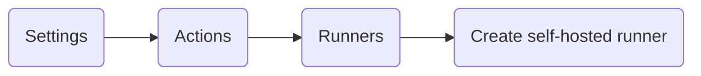

# Liens utiles

- **Comprendre les actions :**  https://docs.github.com/en/actions/learn-github-actions/understanding-github-actions?learn=getting_started&learnProduct=actions

- **Syntaxe des workflows :**  https://docs.github.com/en/actions/using-workflows/workflow-syntax-for-github-actions#run-name

- **Docker hub: GitHub Runner :** https://hub.docker.com/r/tcardonne/github-runner

# Arborescence du projet

```

root
|
|__ compose-inte.yaml
|
|__ compose-prod.yaml
|
|__ compose.yaml
|
|__ site
|   |__ index.html
|
|__ .github      
|   |__ workflows
|
|__ .git
|   |__ ...
|
|__ .gitignore
|
|__ .gitlab-ci.yml

```

# Création d'un self-hosted runner

## GitHub :

Afin de créer un Runner sur Github il existe deux possibilités :

### Création basique :

- Suivre le chemin suivant depuis le dépot du projet (Repository)



- Choisir le système d'exploitation utilisé ainsi que l'architecture processeur.

- Suivre les instructions fournies par GitHub.

### Création d'un runner au sein d'un conteneur :

- Il est possible de conteneurisé un runner pour cela il est nécessaire de :
    - [ ] Créer un Token d'accès sur github
    - [ ] Créer un dossier contenant le fichier **compose.yml** sur la machine hôte
    - [ ] Exécuter dans ce dossier le conteneur à l'aide de :
        ```bash

        docker compose up -d

```
    - [ ] Créer un fichier **.env** contenant les variables nécessaires au conteneur.

- Le fichier **compose.yml** contient les éléments suivants :

```yaml
version: '3.7'
services:
    githubrunner:                  # Nom du service
        image: tcardonne/github-runner:latest  # Image à récupérer
        env_file:
        - ./ghrunner.env # Fichier des variables d'environnements
        volumes:
            - /var/run/docker.sock:/var/run/docker.sock

```

- Le fichier **.env** contient les variables suivantes :
```text

RUNNER_REPOSITORY_URL=https://github.com/url/depot

GITHUB_ACCESS_TOKEN=le_token_du_runner

```

- La liste des variables d'environnement peut être trouvé ici :
    - https://hub.docker.com/r/tcardonne/github-runner

## GitLab

### Création basique :

### Création d'un runner au sein d'un conteneur :


