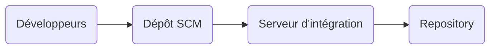
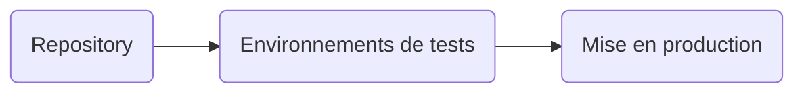

# Liens utiles

- **Comprendre les actions :**  https://docs.github.com/en/actions/learn-github-actions/understanding-github-actions?learn=getting_started&learnProduct=actions

- **Syntaxe des workflows :**  https://docs.github.com/en/actions/using-workflows/workflow-syntax-for-github-actions#run-name

- **Docker hub: GitHub Runner :** https://hub.docker.com/r/tcardonne/github-runner

- **Installation d'un Gitlab Runner (Docker) :**  https://docs.gitlab.com/runner/install/docker.html

# CI - CD : 

- Le CI - CD correspond à un ensemble de pratique permettant d'accéler les étapes de déploiements.
	- CI : Continuous Integrations -> Intégration Continue
		- Cherche à automatiser les opérations autour du développement
	- CD : Continuous Deployment -> Déploiement Continu
		- Cherche à automatiser les opérations autour du déploiement
		
- Schéma de fonctionnement dans la chaîne CI : 



- Schéma de fonctionnement dans la chaîne CD :



- Le CI - CD permet donc : 
	- Une mise en production plus rapides 
	- Une mise en production plus sûre grâce à une suite de tests automatisé et une inspection continue du code à la recherche de potentielles failles 

- Afin d'automatiser tout ces processus et selon les dépôts utilisés il est nécessaire d'utiliser des pipelines (Gitlab) ou workflows (Github).
	- Les pipelines correspondent à des scripts qui se déclenchent en fonction de différentes actions réalisées.

- L'exécution de ces scripts (Pipelines ou Workflows) doit être réalisée à l'aide de **runners**. 
	- Les runners sont des machines (physiques ou virtuelles) dans laquelle différentes tâches vont être réalisée, ces tâches sont définies par les scripts fournis (=> pipelines)


# Arborescence du projet

```
root
|
|__ compose-inte.yaml
|
|__ compose-prod.yaml
|
|__ compose.yaml
|
|__ site
|   |__ index.html
|
|__ .github      
|   |__ workflows
|
|__ .git
|   |__ ...
|
|__ .gitignore
|
|__ .gitlab-ci.yml
```

# Création d'un self-hosted runner

## GitHub :

Afin de créer un Runner sur Github il existe deux possibilités :

### Création basique :

- Suivre le chemin suivant depuis le dépot du projet (Repository)


- Choisir le système d'exploitation utilisé ainsi que l'architecture processeur.

- Suivre les instructions fournies par GitHub.

### Création d'un runner au sein d'un conteneur :

Il est possible de conteneurisé un runner pour cela il est nécessaire de :

- [ ] Créer un Token d'accès sur github
- [ ] Créer un dossier contenant le fichier **compose.yml** sur la machine hôte
- [ ] Exécuter dans ce dossier le conteneur à l'aide de : **docker compose up -d** 
- [ ] Créer un fichier **.env** contenant les variables nécessaires au conteneur.

- Le fichier **compose.yml** contient les éléments suivants :

```yaml
version: '3.7'
services:
    githubrunner:                  # Nom du service
        image: tcardonne/github-runner:latest  # Image à récupérer
        env_file:
        - ./ghrunner.env # Fichier des variables d'environnements
        volumes:
            - /var/run/docker.sock:/var/run/docker.sock

```

- Le fichier **.env** contient les variables suivantes :
```text
RUNNER_NAME=le_nom_du_runner

RUNNER_REPOSITORY_URL=https://github.com/url/depot

GITHUB_ACCESS_TOKEN=le_token_du_runner

```

- La liste des variables d'environnement peut être trouvé ici :
    - https://hub.docker.com/r/tcardonne/github-runner

## GitLab

### Création basique :

### Création d'un runner au sein d'un conteneur :

# Création d'un pipeline : 

## Github : 

- Les pipelines sur Github sont nommés "Workflows".
- Les workflows sont définies dans un fichier au format .YAML placé dans un dossier à la racine du projet 
- Le chemin de ce dossier est le suivant : 
```
root
|
|__ .github
|	|
|	|__ workflows
|		|
|		|__ workflow1.yaml
|		|__ workflow2.yaml
|
|__ src
```

- Les principaux éléments composants un fichier workflow.yaml sont les suivants : 

| Clef | Description|
| ---- | ------------ |
| name | Le nom du workflow, unique pour chaque fichier |
| on | Evénement déclencheur (push, merge..) |
| jobs | Ensemble de tâches exécutée sur le runner, par défaut les jobs sont exécutés parrallélement. |
| steps | Correspond à des actions prédéfinies ou personnalisées |
	

Dans notre cas le fichier .yaml est construit de la sorte : 

```yaml
# Nom du workflow (Pipeline) :

name: Build Docker Image

# Quand déclencher le workflow

on:
  # Au moment du push :
  push:
    # Quand le push est réalisé sur la branche main
    branches: ['main']
    # Et qu'il existe des changements dans les fichiers suivants
    paths:
      - src/**/*
      - Dockerfile
      - .github/**/*

# Définition des tâches :
jobs:
  Build:
    # Définition du runner -> Ici self-hosted : Runner personnel
    runs-on: self-hosted
    # Définition des différentes étapes
    steps:
      # Définition de la version des actions à utiliser
      - uses: actions/checkout@v3
      - name: Log to registry
        # Ceci exécute une commande donnée sous la forme d'une chaîne de caractére
        run: echo ${{secrets.RUNNER_PTA}} | docker login -u ${{github.actor}} --password-stdin ghcr.io
        
      - name: Build docker image
        run: docker image build -t ghcr.io/${GITHUB_REPOSITORY}:latest --build-arg BASE_IMAGE=httpd:2.4 .

      - name: Push on registry
        run: docker image push ghcr.io/${GITHUB_REPOSITORY}:latest

      - name: Logout
        run: docker logout ghcr.io

  # Déploiement de l'image docker

  Deploy:
    runs-on: self-hosted
    # Dépendance avec le job précisé dans un tableau
    needs: ['Build']
    
    steps:
      - uses: actions/checkout@v3
      
      - name: Log to registry
        run: echo ${{ secrets.RUNNER_PTA}} | docker login -u ${{ github.actor }} --password-stdin ghcr.io
        
      - name: Deploy app
        run: docker-compose -f compose-prod.yaml up -d

      - name: Logout
        run: docker logout ghcr.io
```

