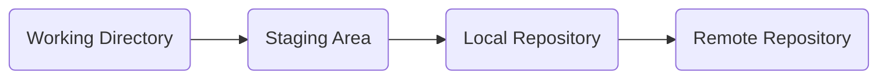
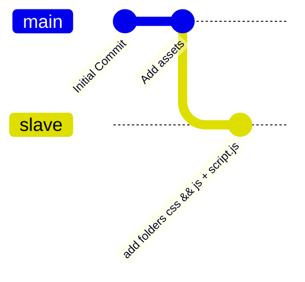

## Checklist de configuration

- [x] Installer VSCode sur la machine et l'ajouter dans le menu contextuel
- [x] Installer **Git Bash**
- [ ] Configurer Git
	- [ ] username
	- [ ] email
- [ ] Configurer l'accès à GitHub (ou GitLab)
	- [ ] Créer une clef ssh sur Git (CLI)
	- [ ] Créer le fichier de configuration des clefs SSH


## Vue d'ensemble du versionning sur GIT



- **Working Directory** : zone de travail, dossier en cours, sous contrôle de version
- **Staging Area** : zone temporaire de fichiers "en attente de validation" = brouillon
- **Local Repository** : Dépôt local
- **Remote Repository** : Dépôt Distant

## Principales commandes GIT

### Initialiser un dépôt GIT

```shell
# Initialiser un dépôt GIT
git init

# Status des fichiers versionnés
git status

# Ajouter un fichier à la staging area 
git add 'fichier.f'

# Sauvegarder les changements
git commit -m 'Message du commit' # -m pour l'option de message

# Consulter le journal des commits (log)
git log
git log --oneline # Version simplifiée du message

# Lister les branches
git branch

# Créer une branche et s'y placer
git branch "nom_de_la_branche"
git checkout "nom_de_la_branche"

# Configuration de Git
git config --global user.name "name" # Configuration du nom d'utilisateur 
# Configuration de l'email utilisateur
git config --global user.email "mail"

# Vérifier la configuration
git config --list
```

### Schéma d'un système de commits 




## Configurer l'accès à GitHub

```ad-warning
	Il faut générer la clef dans le dossier .ssh :
	cd ~/.ssh
```

### Générer la clef SSH

```Shell
ssh-keygen -t 'algo_de_chiffrement' -C 'coordonées: un email'
# Soit
ssh-keygen -t 'ed25519' -C "mail@mail.fr"
```

### Modifier le fichier de configuration des clefs SSH

```shell
Host github.com # Label du serveur distant = Le nom du serveur

    HostName github.com # Nom DNS ou @IP

    User git # Nom d'utilisateur

    IdentityFile ~/.ssh/[clef_privée] # Chemin vers la clef privée à utiliser
```

